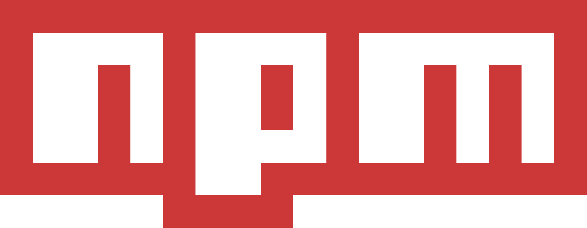

> [NPM](https://www.npmjs.com/) (Node Package Manager) 是 Node.js 的套件管理工具。就跟 Ruby 的 gem 或是 Asp.Net 的 Nuget 是扮演相同的角色，負責管理專案使用的模組，像是模組的下載、版本、移除...等。
  
> 由於 JavaScript 是前端的語言，所以近年來 Node.js 逐漸成為前端的開發必備環境，許多前端開發工具都是跑在 Node.js 之上，像是 [Gulp](http://gulpjs.com/), [Grunt](http://gruntjs.com/), [Webpack](https://webpack.github.io/)。因此 NPM 也成為前端必會的基礎工具之一！


## 前言

一般新手要學 npm 通常是指 npm CLI Command 及 package.json 兩個部分，但實際上 npm 的東西很多，像是 npmrc (npm 設定檔)、npm registry、semver、npm access等

雖然涵蓋的東西多，但實際上一般開發者只要會 npm CLI Command 及了解package.json 的設定就足夠了！

如果有要做開源模組的話，需要多瞭解 npm scope、semver，可以看我的下一篇文章 **npm 開源模組**！

其他的功能一般工程師就比較少用到，像是 **npm Enterprise** ，是在公司內部架設 npm registry ，通常是公司有限制對外連線時，才會使用。這些在特定情境下才會使用的功能，就等用到了再來研究吧！

### 名詞解釋

> * CLI - Commond Line Interface：對應的是 GUI (圖形化介面)，CLI 通常只支援 **鍵盤輸入指令** ，不支援滑鼠操作。像是 Windows 的 **命令提示字元** 、 **PowerShell** 或是 Mac 的 **terminal** 都是CLI工具
> * CLI Commond - 指令：在 CLI 中，沒有圖形化的介面，所有事情都是靠指令完成，像是 `mkdir <name>` ， mkdir 就是一個 **指令** 用來建立資料夾，後面的\<name>就是資料夾的名稱。

## 快速上手

只要安裝完 Node.js 就會有 NPM 的指令，如果你還沒安裝請先到[官網](https://nodejs.org/en/)下載並完成安裝！

安裝完成後，開啟 Command Line，並輸入 npm 按下 Enter，如果有出現指令提示(如下圖)就表示已經有 npm 指令！


接著我們先建立一個專案的資料夾，並移動到資料夾底下

```bash
mkdir <project_name>
cd <project_name>
```

### NPM 起手式

```bash
npm init
```

所有的 **Node** 或 **前端** 專案，在建立專案資料夾後，起手就會先執行 `npm init`。

`npm init` 這個指令，會問你一些關於專案的問題，像是專案名稱、專案的描述、專案的入口點、測試指令、git遠端儲存庫位置、專案作者... 等問題。

完成後，會在專案資料夾下建立一個 **package.json** 檔案，這個檔案就是專案的描述檔，專案的所有資訊都會存在這裡。

以下是 npm init 產出的 package.json 檔案內容

```json
{
  "name": "demo",
  "version": "1.0.0",
  "description": "npm 新手上路範例",
  "main": "index.js",
  "scripts": {
	"test": "echo \"Error: no test specified\" && exit 1"
  },
  "author": "Jerry-Hong <s6323859@hotmail.com>",
  "license": "ISC"
}

```

* name - 專案名稱：全小寫，單字之間用 - 隔開
* version - 專案版本
* description - 專案描述
* main - 程式起始點 (非套件的前端專案不用理會，預設為 index.js)
* script - 自定義腳本
* author - 專案作者：格式請用 ”姓名 \<Email\> (個人網站連結)“
* license - 授權許可

### NPM 安裝模組

```bash
npm install package_name
```

這大概是平常最常用到的 npm 指令，我們這裡用 [lodash](https://lodash.com/) 做範例。

```bash
npm install lodash
```

執行這行後，npm 就會去到遠端找到 lodash 這個模組，並下載 lodash 到我們專案資料夾底下的 node_modules 資料夾裡。


這樣一來我們就可以在js檔裡用 CommonJS 的語法來 載入 **lodash**。
首先建立一個 index.js，接著在 index.js 裡載入 lodash 模組

```javascript
var lodash = require('lodash');
```

這樣我們就可以使用 lodash 提供的方法了

```javascript
var lodash = require('lodash');
var result = lodash.map([1, 2, 3], function(n) { return n + 3; });

console.log(result);
```

接著就能用 `node index.js` 來執行這段程式

看到以下輸出就代表成功了


我們已經成功安裝完 lodash 了。

但當我們模組安裝越多， node_modules 資料夾的資料量就會非常大，所以一般 node_modules 資料夾是不會進版控的！

這時當我們在 clone 別人的專案時，就必須重新安裝模組，但我們不可能記得所有相依的模組，所以我們需要在安裝時，加上相依參數。


### 執行時相依

一般在安裝模組時，我們都會附帶參數來紀錄我們專案使用到的模組。

```bash
npm install lodash --save
```

當我們加了 `--save` 來安裝模組，這個模組相依就會被紀錄在 package.json 裡，代表我們的專案和 lodash 模組是 **執行相依** 的

```json
{
  "name": "demo",
  "version": "1.0.0",
  "description": "npm 新手上路範例",
  "main": "index.js",
  "scripts": {
	"test": "echo \"Error: no test specified\" && exit 1"
  },
  "author": "Jerry-Hong <s6323859@hotmail.com>",
  "license": "ISC",
  "dependencies": {
    "lodash": "^4.16.4"
  }
}
```

這時我們把 node_modules 資料夾刪除，再執行一次 `npm install` ，就能發現 lodash 自動被下載到 node_module 底下了。
這樣一來只要靠 package.json 我們就能找回專案相依的所以模組了。

### 開發時相依

```bash
npm install webpack --save-dev
```

有些 npm 模組裝起來就只是為了幫助我們開發專案用的，像是前端專案的 webpack, gulp, grunt 都是幫助我們開發用的工具；或者像 node 專案的 nodemon 也是幫助我們開發用的工具，這些模組都有一個共通的特性就是只有開發時才會用到。

```json
{
  "name": "demo",
  "version": "1.0.0",
  "description": "npm 新手上路範例",
  "main": "index.js",
  "scripts": {
	"test": "echo \"Error: no test specified\" && exit 1"
  },
  "author": "Jerry-Hong <s6323859@hotmail.com>",
  "license": "ISC",
  "dependencies": {
    "lodash": "^4.16.4"
  },
  "devDependencies": {
    "webpack": "^1.13.2"
  }
}
```
後續跟 `--save` 一樣，都可以透過 `npm install` 來重新裝回這些相依的模組，而 **開發時相依** 與 **執行時相依** 最大的差別就在於做開源模組時，假設別的使用者透過 npm 下載我們的模組，這時就只會下載 我們的模組與跟我們模組執行時相依的模組。